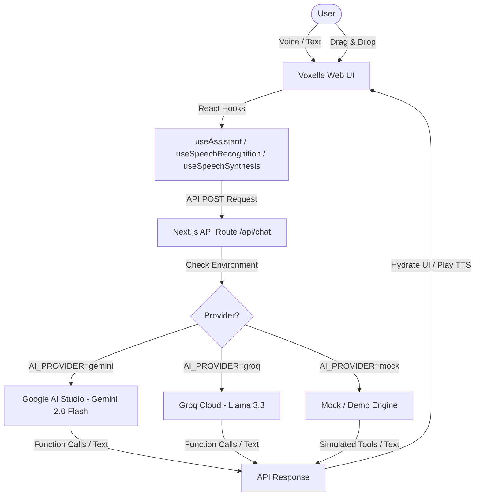

# 🌌 Voxelle — Multimodal Voice AI Assistant

Voxelle is a cutting-edge, voice-first multimodal AI assistant designed with a futuristic cyber-dark aesthetic. Built on the modern **Next.js 16 (App Router)** and **React 19**, Voxelle integrates state-of-the-art Web Speech technologies, advanced AI reasoning, and multi-provider LLM support. It features a stunning glassmorphic UI, responsive micro-animations, real-time function calling panels, and full multimodal vision capabilities.

---

## ✨ Features at a Glance

### 🎙️ Speech-First Interactions
*   **Intelligent Speech-to-Text (STT):** Fully integrated with the browser's Web Speech API for low-latency voice recognition. Hands-free input that auto-triggers assistant pipeline actions.
*   **High-Fidelity Text-to-Speech (TTS):** Naturally speaks responses back using prioritized high-fidelity voices (Google Natural, Samantha, Daniel, or system-preferred English engines).
*   **Manual Stop controls:** Instant mute or audio interruption controls to silence spoken feedback in a single tap.

### 🌐 Advanced Multi-LLM Provider Engine
Equipped with a highly versatile server-side API router (`/api/chat`) that can be hot-swapped via environment variables:
1.  **Google Gemini (Gemini 2.0 Flash):** Native support for multimodal vision input, advanced reasoning, and developer-defined tool function calling.
2.  **Groq (Llama-3.3-70b-versatile):** Ultra-low-latency response stream with function calling capability.
3.  **Frictionless Demo Mode:** A standalone mock mode that works immediately **without any API keys**, enabling full simulated demonstrations of chatbot responses and smart home/calendar tool actions.

### 🔌 Intelligent Tool Execution (Function Calling)
Voxelle doesn't just talk — it acts. Built with direct tool calling definitions, it processes instructions into structured API payloads with real-time UI logging:
*   **📅 Calendar Event Scheduler (`add_calendar_event`):** Automates scheduling, booking meetings, setting reminders, or registering calendar dates.
*   **🏠 Smart Home Device Controller (`toggle_smart_home_device`):** Toggles devices on or off (lights, AC units, fans, TVs, thermostats) with structured arguments.

### 🖼️ Multimodal Vision Integration
*   **Interactive Drag & Drop:** Attach any image file via the custom React Dropzone overlay.
*   **Visual Reasoning:** Gemini reads, analyzes, and answers questions about attached images, allowing you to ask, *"What's in this picture?"* or *"Can you write a caption for this?"*

---

## 🎨 Design System & Aesthetics

Voxelle features a high-fidelity visual layout inspired by cyberpunk interfaces. The application uses a custom-curated theme leveraging **Tailwind CSS v4** and **Framer Motion**:

| Visual Feature | Description | Styling & Animations |
| :--- | :--- | :--- |
| **Cyber-Dark Theme** | Deep cosmic background (`#06070d`) with neon accent highlights. | Harmonic HSL variables, custom selection glows |
| **Glassmorphism** | Semi-transparent frosted panels that blend seamlessly. | CSS `backdrop-filter: blur(20px)` and subtle white borders |
| **Responsive Mic Ripples** | Concentric neon waves pulsing outward in listening mode. | Framer Motion ripples with custom stagger delays |
| **Thinking Orbitals** | Rotating purple dots that orbit the mic button when the AI is processing. | Continuous CSS and Motion keyframe rotations |
| **Interactive Waveform** | Inner-button wave visualizers mapping distinct assistant states. | State-controlled SVG scaling (idle, listening, processing, speaking) |
| **Real-time Tool Drawer** | Sidebar detailing executed tool definitions, arguments, and status. | Spring physics layout transitions with shimmer animations |

---

## 🛠️ Architecture & Tech Stack



*   **Framework:** Next.js 16 (App Router, React 19)
*   **Language:** TypeScript
*   **Styling:** Tailwind CSS v4, custom CSS variables, `@tailwindcss/postcss`
*   **Animations:** Framer Motion 12
*   **Core Libraries:** `react-dropzone`
*   **APIs:** Web Speech API (Recognition + Synthesis), Google Generative Language API, Groq Cloud API

---

## 🚀 Getting Started

Follow these instructions to run a local instance of Voxelle.

### 📋 Prerequisites
*   Node.js 18+ or npm/pnpm/yarn.

### 1. Clone the Repository
```bash
git clone https://github.com/your-username/voxelle.git
cd voxelle
```

### 2. Install Dependencies
```bash
npm install
```

### 3. Configure the Environment
Create a `.env.local` file in the root directory. Configure your desired LLM provider (defaults to `mock` if none is configured):

```env
# Define the active provider ('gemini', 'groq', or 'mock')
AI_PROVIDER=gemini

# Add your API Keys as needed
GEMINI_API_KEY=your_google_gemini_api_key_here
GROQ_API_KEY=your_groq_api_key_here
```

> [!TIP]
> If you don't have an API key right now, simply set `AI_PROVIDER=mock`. The assistant will work immediately with pre-configured mock scenarios for calendar and smart home actions!

### 4. Run the Development Server
```bash
npm run dev
```

Open [http://localhost:3000](http://localhost:3000) in your browser to interact with Voxelle.

---

## 💡 Usage Examples

To experience the AI's full capabilities and test the native tool execution:

*   **Ask for smart home controls:** *"Hey Voxelle, turn off the living room lights."*
    > ➔ You will see the **Smart Home tool card** populate in the side drawer, transition to a purple running status, and resolve with a green completed badge!
*   **Ask to book a meeting:** *"Can you schedule a meeting tomorrow at 3:00 PM?"*
    > ➔ The **Calendar tool card** will activate, extracting the title, time, and date parameters dynamically.
*   **Attach an image:** Open the image uploader, drop in a picture, and type/speak: *"Explain what you see in this photo."*

---

## ⚙️ Diagnostic Center & Browser Support

Voxelle includes a built-in diagnostic warning system. If certain browser configurations or permissions are missing, an overlay banner will guide the user:

*   **Microphone Access Denied:** Promptly warns users to authorize microphone permissions in browser settings.
*   **Speech Recognition Support:** Recommends optimal browsers (Google Chrome, Microsoft Edge, Safari) if the user's browser lacks Web Speech compatibility.
*   **Speech Synthesis Support:** Validates that native text-to-speech engines are available.

---

## 📄 License

This project is licensed under the MIT License. See [LICENSE](LICENSE) for details.
